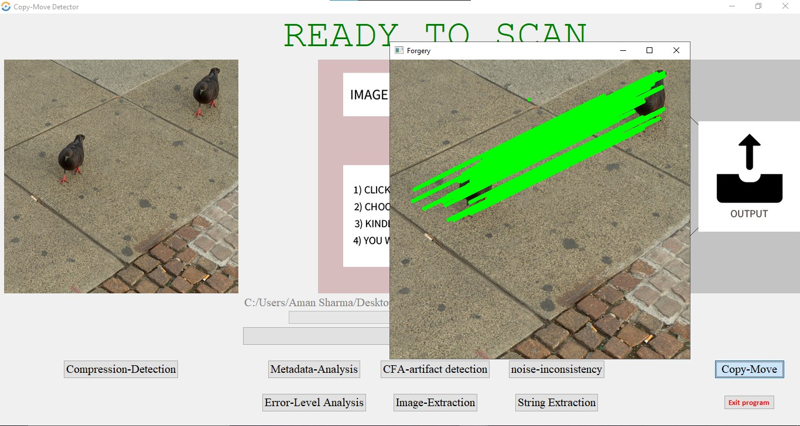

# image-manipulation-detection-system
Detecting and localizing image manipulation are necessary to counter malicious use of image editing techniques. Accordingly, it is essential to distinguish between authentic and tampered regions by analyzing intrinsic statistics in an image.

# Image Forgery Detection Tool
The forgery detection tool contained in this repository currently features forensic methods to detect the following:

- Double JPEG compression
- Copy-move forgeries
- Metadata Analysis
- CFA artifacts
- Noise variance inconsitencies
- Error Level Analysis
- Image Extraction
- String Extraction

## To Run:
<!-- Place any(JPEG) images that you wish to analyze into the **image** folder Present in the Project directory. -->

Navigate to the **DBSCAN** directory:
```
$ cd DBSCAN
```

Next, run the **detect.py** script, providing the image you wish to evaluate:
```
$ python GUI.py
```

Once finished, details on the image will be reported in the terminal. Supplemental images generated during copy-move forgery detection can be found in the output directory.

##  IMAGES


